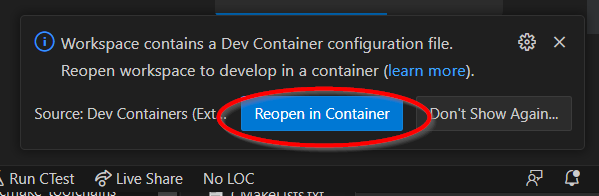
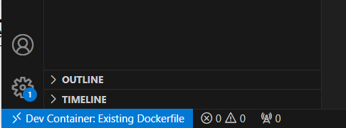

# VSCode Dev Container development

A Dockerfile has been added, which contains a complete development environment that is consistent across all operating systems supporting Docker.

When VSCode encounters a `.devcontainer` directory, it will prompt you to open the workspace inside a [DevContainer](https://code.visualstudio.com/docs/devcontainers/containers).  The entire build system is defined by the *DockerFile*, 

## Initial Setup
1. Install all [prerequisites](##prerequisites)
2. Open `hellow_world.code-workspace` in VSCode.  You may be prompted to open the workspace in a dev container - select **Reopen In Container**.  This will build and start the docker contain, then reopen VSCode *inside* the container. 

    
    
    After VSCOde is running inside the container, the lower left corner of VSCode wil look something like this:

    
3. Your environment is all setup, continue with instructions from development-environment.md

## Prerequisites

### MS Windows based development

* [Docker Desktop](https://www.docker.com/products/docker-desktop/)
* WSL 2
* VSCode
* VSCode Extension : Dev Containers - Microsoft
* VSCode Extension : C++ Extension Pack - Microsoft
* VSCode Extension : CMake - twxs (optional - CMake syntax highliting)

### Linux based development
* Docker Desktop
* VSCode
* VSCode Extension : Dev Containers - Microsoft
* VSCode Extension : C++ Extension Pack - Microsoft
* VSCode Extension : CMake - twxs (optional - CMake syntax highliting)